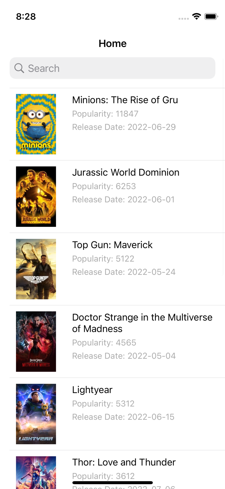
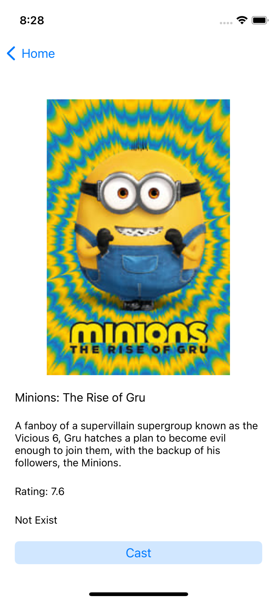
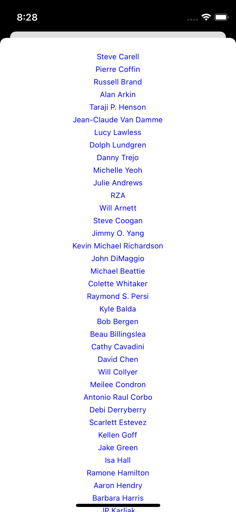
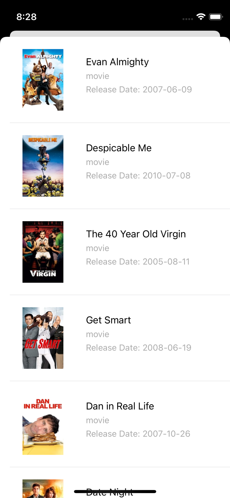

# List any products using VIPER pattern

Protocol based code base on using VIPER pattern. Each page has own files sctructers and models and also network layer was 
isolated from page sctructers.

Home Page | Movie Detail | 
--- |  --- | 
 |  |

Movie Credits | Person Detail | Person Credits |
--- |  --- | --- | 
 |  | 